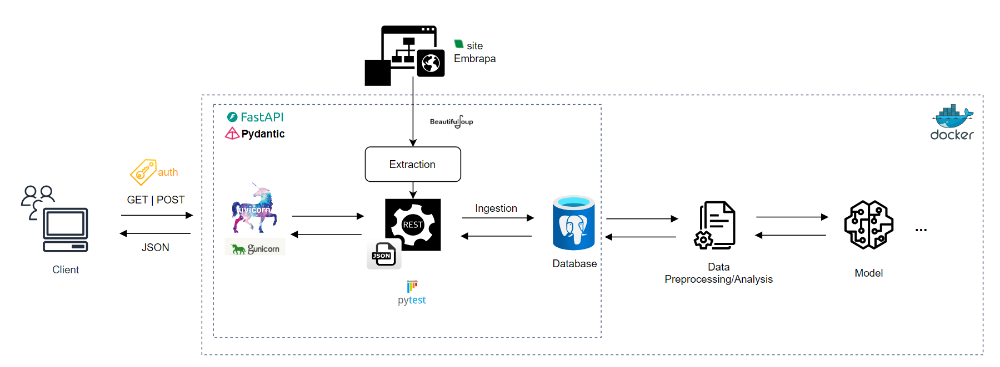
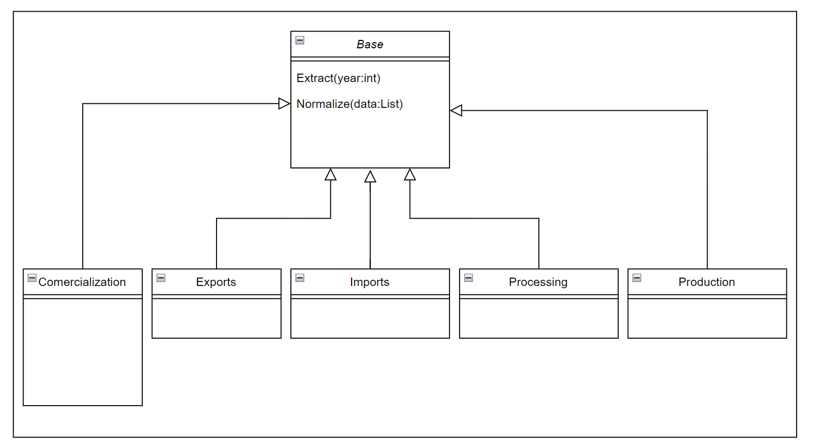
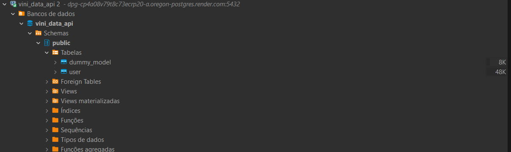
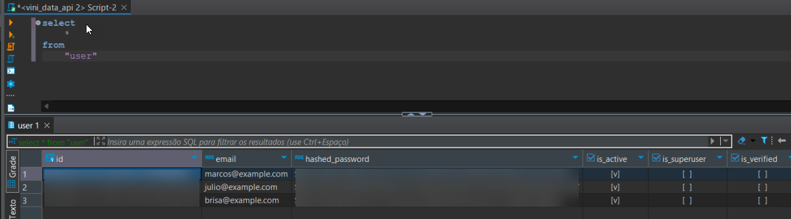

# **Arquitetura** :triangular_ruler:
## **Diagrama de Arquitetura**
Para uma compreensão mais detalhada da arquitetura do projeto, preparamos um diagrama de Arquitetura. Este diagrama ilustra de forma resumida como o dado é obtido a partir das interações do cliente até a entrada dos dados do modelo.

[Diagrama Arquitetura](https://drive.google.com/file/d/1wkqBWUY2eOjV9fB7ssEsUKk0E3UZnBwO/view?usp=sharing)

## **Extração dos dados**
A extração dos dados ocorre por meio de web scraping, sendo que a lógica responsável pela extração dos dados pode ser encontrada em `vini_data_api>web>api>vitivinicultura>extractions`.
De maneira geral o código responsável pela extração dos dados está organizado de modo a se beneficiar da herança e seu diagrama de classes pode ser visualizado abaixo:

[Estrutura código de extração de Dados](https://drive.google.com/file/d/1j4tpnNdg1ZTxORg_rSINcA46nO7Vpcgj/view?usp=sharing)

## **Estrutura código de extração de dados**

A classe Base implementa dois métodos abstratos de modo que obriga seus filhos a implementarem os mesmos métodos mantendo assim um padrão de projeto.
Além dos dois métodos implementados na classe mãe, temos uma função de conexão e extração disponibilizada em `vini_data_api >web>utils` denominado **web_data_extractor**, esta função será consumida em todas as classes filhas com o objetivo de conectar-se a referida página web, extrair seu html e retornar uma lista somente com os dados de interesse para serem posteriormente tratados.

O método **Normalize** se encarrega de formatar a extração dos dados em um json, este json por sua vez é consumido dentro do método **Extract**.

O método **Extract** trata-se do principal método de cada uma das classes filhas, ele é responsável por trabalhar com a saída do método **Normalize** sendo que nele, criamos os objetos "pydanticos" que serão posteriormente devolvidos na resposta da API call e futuramente adicionados ao banco de dados.

Abaixo podem ser visualizados os gists de todas as classes envolvidas nesse diagrama, bem como da função web_data_extractor.

==* Função web_data_extractor==

==* Classe Base==

==* Classe Comercialization==

==* Classe Exports==

==* Classe Imports==

==* Classe Processing==

==* Classe Production==

## **Construção da API**

Em se tratando da construção da API, podemos considerar que o servidor da API construída roda para fins de teste na base do Uvicorn, porém ao subir o servidor para produção espera-se que o mesmo execute sobre a base do Gunicorn, essa troca ocorre por meio da troca do parametro **environment** que faz parte do arquivo ``settings.py`` localizado em `vini_data_api>settings.py` o mesmo arquivo deverá ser utilizado para a configuração da conexão com o banco de dados.

Com relação aos endpoints e a construção de sua lógica, podemos mencionar alguns pontos adicionais, sendo eles:

1. Todos os endpoints foram construídos com objetivo de acessar os dados anualizados, isto se deve ao fato de que pesquisar a base histórica acaba por vezes em problemas de performance e quedas de conexão com o site, com as chamadas anuais, conseguimos mitigar este risco.

2. Existe uma validação implementada que não permitirá que o usuário efetue uma chamada API para um ano fora dos limites onde sabidamente existem dados.

A validação da chamada API dentro de um período específico, pode ser estudada na função **YearRangeValidation** que pode ser encontrada em `vini_data_api>utils>utils.py` esta função foi implementada em cada um dos endpoints disponíveis de modo que somente serão executadas as API calls para os períodos de data pré-estabelecidos.

Os endpoints disponíveis, poderão ser encontrados em `vini_data_api>web>api>vitivinicultura>views.py`, para a construção dos mesmos, foi utilizada a lib **FastAPI** e nesta sessão não entraremos no detalhe de cada endpoint, pois o mesmo será documentado na sessão seguinte do presente documento.

Para fins de consulta ao código, favor referir aos gists relacionados abaixo:

==- Gist UTILS YearRangeValidation==

==- Gist views.py==

## **Persistência no Banco de Dados**
A persistência de dados desse projeto é realizada por meio de modelos no código usando SQLAlchemy que mapeia as informações da normalização para as tabelas finais no banco de dados PostgreSQL. A biblioteca FastAPI utiliza esses modelos para validar e serializar dados, enquanto o SQLAlchemy gerencia as sessões e transações de banco de dados gravando as informações pertinentes.

Foi necessário realizar a criação do database **vini_data_api** e o deploy do banco de dados no Render.

*Database vini_data_api*

Ao executar o projeto, o ORM escolhido se encarrega de criar as tabelas no banco de dados configurado nos schemas dos modelos.

*Query para consulta na tabela Users*

Nessa etapa do projeto foram persistidos apenas os registros de usuários da API na tabela “user”. Isso ocorre porque os dados consumidos pelo modelo de Machine Learning serão extraídos pela API em formato ``.json``, conforme previsto na arquitetura e nos requisitos do Projeto.
