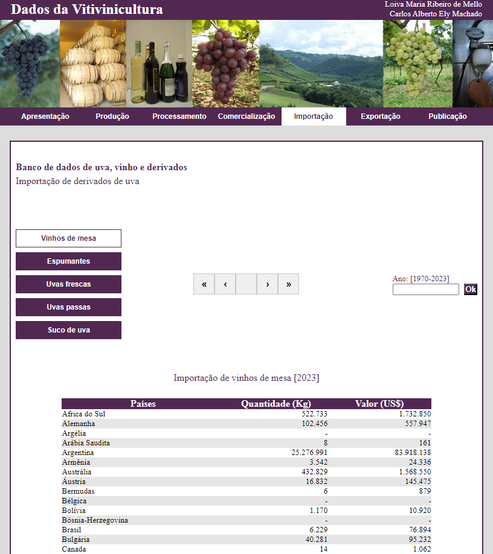
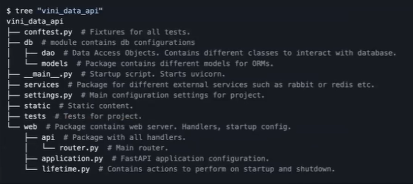
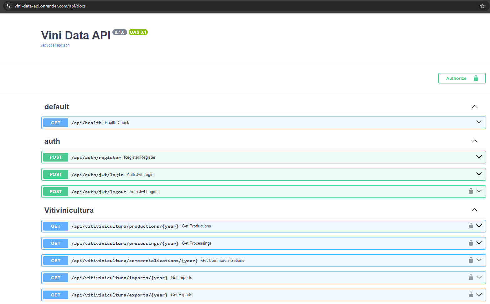

# **Projeto** :bar_chart:
## **Origem dos dados**
O site de vitivinicultura da Embrapa dispõe de dados quantitativos de uvas processadas, produção e comercialização de vinhos, suco e derivados provenientes do Estado do Rio Grande do Sul, grande contribuinte para a produção nacional desses insumos. Além disso, dispõe de dados de importações e exportações dos produtos da vitivinicultura, incluindo Países de Origem/Destino, quantidade e valor associado. Os dados disponibilizados possuem um recorte histórico que tem início em 1970 até 2023.

[Site de Vitivinicultura - Embrapa 2024](http://vitibrasil.cnpuv.embrapa.br/)

## **Desenvolvimento da aplicação**
Esse projeto foi desenvolvido usando o fastapi_template, configurando as etapas a seguir:

- API type: REST API
- Database: PostgreSQL database
- ORM: SQLAlchemy
- CI/CD: nesse momento optamos por não utilizar

E como configuração adicional, definimos a opção *add fastapi-users support* como ativa, para atingir o objetivo do projeto para autenticação de usuários.

Também configuramos as opções *add dummy model*, *add example routers*, *add loguru logger* para fornecer orientações sobre como construir outros módulos, rotas e logs na aplicação, respectivamente. Além das configurações mencionadas, implementamos o recurso “add gunicorn server” para atuar como servidor de produção da aplicação.

A configuração de backend disponível no template permite duas configurações específicas: *add authentication via cookie support* e *add JWT auth support*, ambas foram definidas para essa etapa do projeto.

Após a configuração do template, a raiz do repositório ficou com a seguinte estrutura:

[Link para o repositório do Template](https://github.com/s3rius/FastAPI-template)

## **Deploy da aplicação**

O deploy da aplicação e do banco de dados foi realizado utilizando a Cloud Render. Abaixo os links para aplicação, documentação e seus repositórios.

[Repositório de código remoto](https://github.com/marcosnataqs/vini_data_api)

[Deploy da API](https://vini-data-api.onrender.com/api/docs)

[Repositório da Documentação](https://github.com/marcosnataqs/vini_data_api_docs)

[Documentação](https://marcosnataqs.github.io/vini_data_api_docs/arquitetura/)

## **Modelo de Machine Learning**
Abaixo seguem algumas aplicações possíveis dos dados desta API em projetos de machine learning:

1. **Tipo Regressão**: 
> Predição de quantitativos de produção e comercialização de produtos
>
> Estimativa de valores monetários para Importação e Exportação.

2. **Tipo Classificação**:
> Classificar o potencial de consumo dos países para determinados produtos em Alto, Médio e Baixo

3. **Tipo Clusterização**:
> Grupo de potenciais clientes interessados por um determinado produto
>
> Nessa fase do projeto não focaremos no Modelo de Machine Learning e sim no desenvolvimento do projeto da API desde a ingestão dos dados até a alimentação do modelo.

:pencil: **Nota:** *As aplicações de modelos de Machine Learning levantadas nessa seção serão validadas no decorrer do projeto principalmente após a etapa de pré processamento e análise dos dados.*